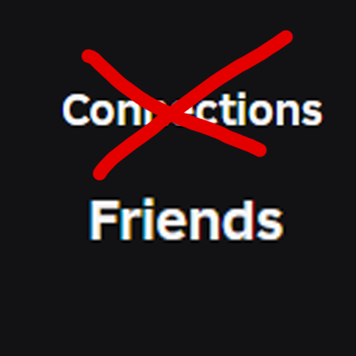

# Roblox Connections Renamer

A lightweight browser extension that renames all instances of "Connections" on Roblox back to "Friends".

## ✨ What It Does

This extension automatically replaces every instance of the term "Connections" with "Friends" across the Roblox website interface, including buttons and page titles, to restore the classic terminology that users are more familiar with. It also updates related terms like "Connection", "Connect", and "Remove Connection" to their "Friend" counterparts.

## 📥 Installation

Choose your browser for setup instructions:
[Simple Installation Video](https://www.youtube.com/watch?v=Fv9L5ZtBF_w)
- [Chrome](InstallationMethods/chrome.md)
- [Opera](InstallationMethods/opera.md)

## ⚖️ License

This project is **© Copyright GR33NVR 2025**.  
All rights reserved.  
You may not distribute, modify, or reupload this extension without explicit permission.
For more information read the [license](LICENSE)
